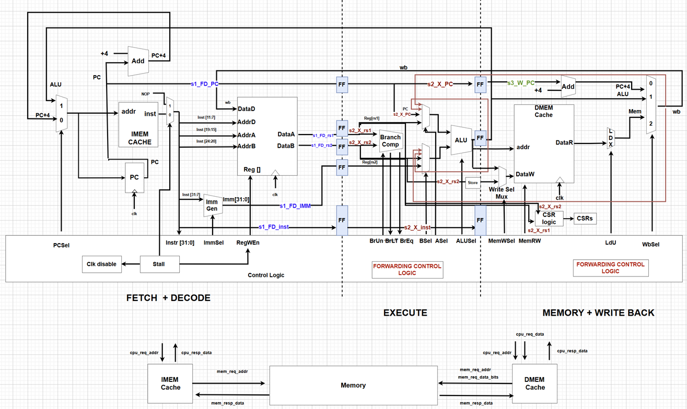
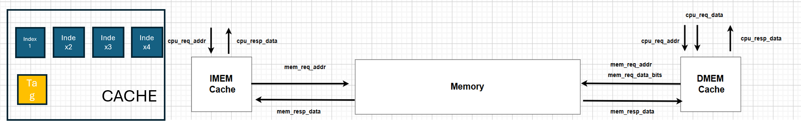
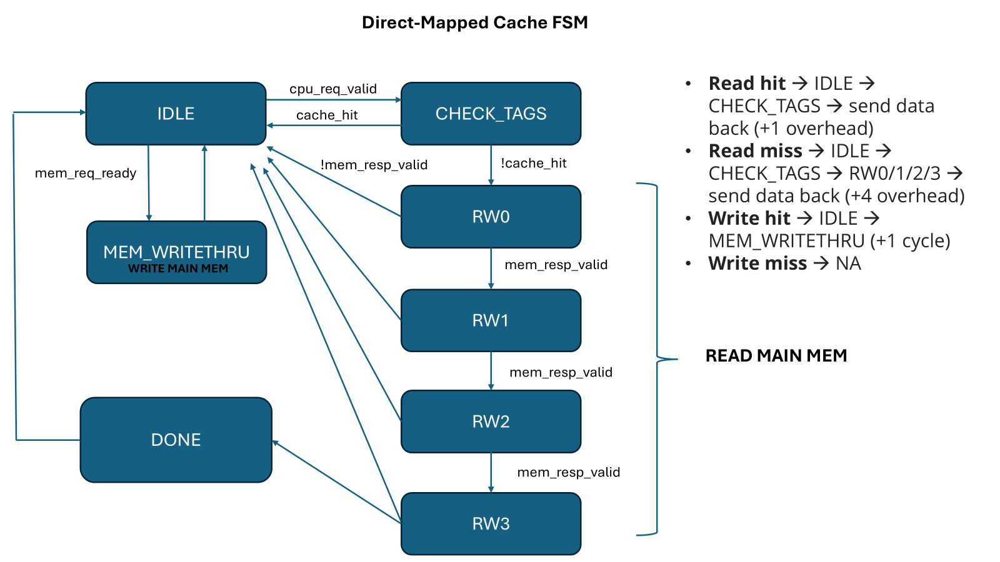
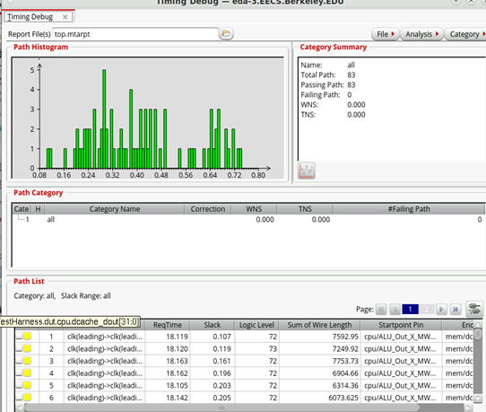

# EECS251LA: Introduction to Digital Design and Integrated Circuits Lab
### Project report on design of a RISC-V 3-stage pipelined CPU for EECS251LA class at UC Berkeley
### Members: Chandrahaas Vadali and Aniket Sadashiva

## Introduction

We implemented a 3-stage pipeline consisting of the following stages:
- **FD** (Fetch and Decode)
- **X** (Execute)
- **MWB** (Memory and Write Back)

## Pipeline Stages

In the **FD** stage, both the **IMEM** and **PC register** were clocked simultaneously. In the **X** and **MWB** stages, the **DMEM** and pipeline registers between these stages were also clocked together.

### (a) FD Stage

The following components are part of the **FD stage**:
- **PC select mux**
- **IMEM**
- **PC register**
- **PC+4 adder**
- **Imm Gen**
- **Register file**

### (b) X Stage

In the **X stage**, we have the following components:
- **Branch comparator**
- **Mux to select the right rs1/rs2 for forwarding**
- **ALU**
- **Store mask**
- **Write select mux (chooses between ALU out and rs2)**

### (c) MWB Stage

The **MWB stage** includes:
- **DMEM**
- **CSR logic**
- **Load MUX**
- **WB MUX**

## Branch Prediction

We went with a simple branch-not-taken strategy. In case of a misprediction, we simply inserted a NOP and reloaded the previous PC and instruction. 

## Cache

Initally, we used a no-cache architecture that reads directly from the memory. We later swwapped it for a direct-mapped cache. 

Here is the FSM for the write-through cache we implemented. 

## Critical Path Analysis

One of the critical paths we anticipated lies between the pipeline register storing the ALU output during the transition from the **X** stage to the **MWB** stage and the **DMEM** cache **dout**. This path corresponds to a **load instruction**. The signals pass through complex logic to determine the **DCACHE read/write enable signals**, access the **DCACHE**, and then traverse the **load MUX** and **WB MUX**. Due to the complexity of this sequence, we expected this path to have the longest delay. Below is the post-PAR timing histogram -

## Forwarding Mechanism

To address the delays and optimize performance, we implemented forwarding for various dependencies:
- **MWB to ALU (1 cycle)**
- **LOAD (2 cycles)**
- **JALR (1 or 2 cycles)**

We implemented forwarding for 1-cycle and 2-cycle dependencies to minimize stalls, particularly in scenarios with no-cache. Additioanlly, in the case of the direct-mapped cache, we disabled the clk on the pipeline registers till both the **DCACHE** and **ICACHE** complete the necessary transactions (particularly for READ) with the memory. 

We began by pipelining all of our data path signals along with a few key control signals. This approach was implemented to ensure that, in case a signal was needed at any stage, we could efficiently feed it to the ALU or read/write addresses to/from the caches. The primary motivation was to prevent stalls that could arise from 1-cycle and 2-cycle dependencies. This strategy proved effective in reducing performance bottlenecks.

Subsequently, we removed any unnecessary signals that had been pipelined in order to minimize power consumption and area usage. Since our design uses a 3-stage pipeline, we anticipated the possibility of a branch misprediction. In the event of a misprediction (where the default assumption was that the branch was not taken), we chose to pass a No-Operation (NOP) instruction rather than stalling for 2 cycles. After the NOP, we could reload the correct PC and instruction, as we had a copy of the previous values, thus ensuring minimal disruption to pipeline flow.

We acknowledged that adding registers throughout the pipeline would result in both a power and area tradeoff. However, we determined that this tradeoff was worthwhile in order to achieve a performance boost. Specifically, in the case of cache-based memory, we had to disable the clock to all registers, effectively freezing the pipeline, while cache interactions were processed. This approach allowed us to avoid unnecessary delays caused by waiting for memory access, improving overall system performance.

